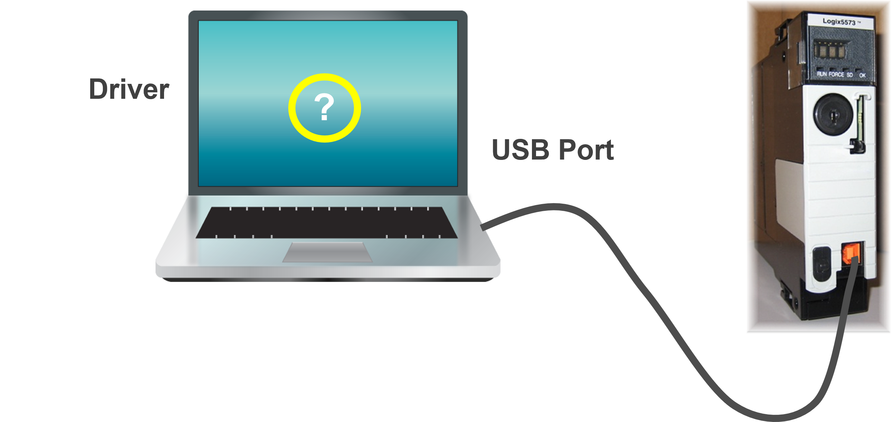
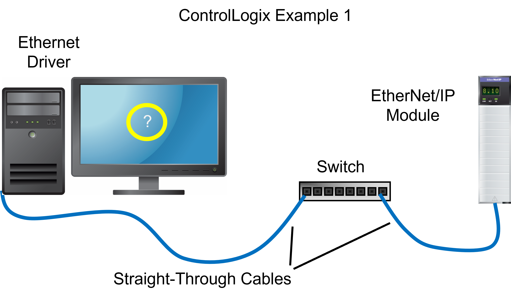
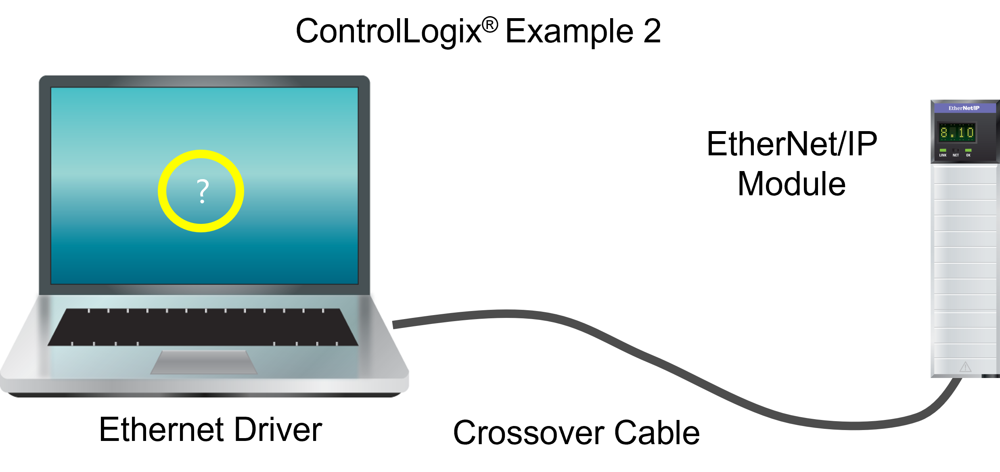

::: comment 

This is an example of a presentation at the learning design outcome level where all content within the outcome is included in a single presentation markdown file. This is a simplified version of a presentation. If there is a future need to present things at the objective level, the contents of this file will need to be 'split up' into a structure similar to the 'outcome_01' structure. 
 
:::

::: rau-slide-overview

## Overview

After completing this lesson, you should be able to:

- Objective ABCD description
- Objective ABCD description
- Objective ABCD description

:::

::: rau-slide-importance

## Importance of Objectives

These objectives are important for the following reasons:

- Objective justification
- Objective justification
- Objective justification

:::

::: rau-slide-activity

## Objective A, Activity

Define the listed terms:

::: notes

The L8x controllers contain an embedded EtherNet/IP™ port, eliminating the need for a separate communications module when communicating on an EtherNet/IP network.

**Answers:**

- Driver: A software configuration that allows a computer to access a specific type of external device, such as a communications card.
- Communications Card: A physical hardware interface that allows a computer to connect to a network.
- Communications Module: Hardware that allows a controller to pass data through a network to a remote device

::: script

This script section is used for the spoken-word dialogue relevant to the content and should remain plain text

:::

:::

:::

::: rau-slide-plain

## Point-To-Point Connection Overview

To connect directly to a controller using a point-to-point connection, the following setup is required:

 

**ControlLogix® USB Example**

Standard Type-A to Type B USB Cable

(maximum length: 3.0 m (9.84 ft) with no hubs)

::: notes

As a stream of single bits, a point-to-point connection is typically the slowest, but it is the easiest way to connect to a Logix 5000™ system.

:::

:::

::: rau-slide-question

## Question

**When going online to troubleshoot, a driver is required for the communications network. What is a driver?**

a) A driver is the hardware interface that allows a computer to connect to a network.
b) A driver is a file that updates module firmware.
c) A driver is a software configuration that allows a computer to access a specific type of external device to connect to a network.
d) A driver is a device that saves and restores communications configuration information

::: notes

ANSWER:
C

:::

:::

::: rau-slide-example

## Example

**EtherNet/IP™ Communications:**

EtherNet/IP communications to a ControlLogix® system can occur using straight-through or crossover cables:

:::

::: rau-slide-example

## Example

::: columns

::: {.column width="60%"}

Many newer computers, Ethernet switches, and select Rockwell Automation EtherNet/IP™ modules can automatically detect an Ethernet cable as being straight-through or crossover communications, eliminating the need to carry both cable types.

:::

::: {.column width="50%"}

:::

:::

{style="width:80%"}

:::

::: rau-slide-activity

## Objective B, Activity

Define the listed terms:

::: notes

The L8x controllers contain an embedded EtherNet/IP™ port, eliminating the need for a separate communications module when communicating on an EtherNet/IP network.

**Answers:**

- Driver: A software configuration that allows a computer to access a specific type of external device, such as a communications card.
- Communications Card: A physical hardware interface that allows a computer to connect to a network.
- Communications Module: Hardware that allows a controller to pass data through a network to a remote device

::: script

This script section is used for the spoken-word dialogue relevant to the content and should remain plain text

:::

:::

:::

::: rau-slide-plain

## Point-To-Point Connection Overview

To connect directly to a controller using a point-to-point connection, the following setup is required:

 

**ControlLogix® USB Example**

Standard Type-A to Type B USB Cable

(maximum length: 3.0 m (9.84 ft) with no hubs)

::: notes

As a stream of single bits, a point-to-point connection is typically the slowest, but it is the easiest way to connect to a Logix 5000™ system.

:::

:::

::: rau-slide-question

## Question

**When going online to troubleshoot, a driver is required for the communications network. What is a driver?**

a) A driver is the hardware interface that allows a computer to connect to a network.
b) A driver is a file that updates module firmware.
c) A driver is a software configuration that allows a computer to access a specific type of external device to connect to a network.
d) A driver is a device that saves and restores communications configuration information

::: notes

ANSWER:
C

:::

:::

::: rau-slide-example

## Example

**EtherNet/IP™ Communications:**

EtherNet/IP communications to a ControlLogix® system can occur using straight-through or crossover cables:

:::

::: rau-slide-example

## Example

::: columns

::: {.column width="60%"}

Many newer computers, Ethernet switches, and select Rockwell Automation EtherNet/IP™ modules can automatically detect an Ethernet cable as being straight-through or crossover communications, eliminating the need to carry both cable types.

:::

::: {.column width="40%"}

:::

:::

:::

::: rau-slide-activity

## Objective C, Activity

Define the listed terms:

::: notes

The L8x controllers contain an embedded EtherNet/IP™ port, eliminating the need for a separate communications module when communicating on an EtherNet/IP network.

**Answers:**

- Driver: A software configuration that allows a computer to access a specific type of external device, such as a communications card.
- Communications Card: A physical hardware interface that allows a computer to connect to a network.
- Communications Module: Hardware that allows a controller to pass data through a network to a remote device

::: script

This script section is used for the spoken-word dialogue relevant to the content and should remain plain text

:::

:::

:::

::: rau-slide-plain

## Point-To-Point Connection Overview

To connect directly to a controller using a point-to-point connection, the following setup is required:

 

**ControlLogix® USB Example**

Standard Type-A to Type B USB Cable

(maximum length: 3.0 m (9.84 ft) with no hubs)

::: notes

As a stream of single bits, a point-to-point connection is typically the slowest, but it is the easiest way to connect to a Logix 5000™ system.

:::

:::

::: rau-slide-question

## Question

**When going online to troubleshoot, a driver is required for the communications network. What is a driver?**

a) A driver is the hardware interface that allows a computer to connect to a network.
b) A driver is a file that updates module firmware.
c) A driver is a software configuration that allows a computer to access a specific type of external device to connect to a network.
d) A driver is a device that saves and restores communications configuration information

::: notes

ANSWER:
C

:::

:::

::: rau-slide-example

## Example

**EtherNet/IP™ Communications:**

EtherNet/IP communications to a ControlLogix® system can occur using straight-through or crossover cables:

:::

::: rau-slide-example

## Example

::: columns

::: {.column width="60%"}

Many newer computers, Ethernet switches, and select Rockwell Automation EtherNet/IP™ modules can automatically detect an Ethernet cable as being straight-through or crossover communications, eliminating the need to carry both cable types.

:::

::: {.column width="40%"}

:::

:::

:::

::: rau-slide-summary

## Summary

You should know how to:

- Objective outcome summary
- Objective outcome summary
- Objective outcome summary

:::

::: rau-slide-thank-you

## Thank You

[[www.rockwellautomation.com](https://www.rockwellautomation.com)]{.ra-link}

:::
