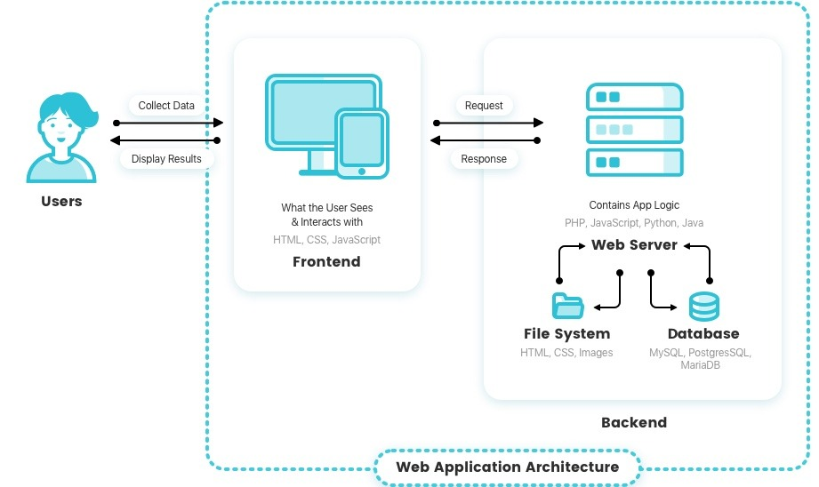

## SCORM / E-Learning Interactive Objects Test

This document demonstrates the syntax and functionality of the interactive objects that can be built into SCORM content.

These objects can be easily inserted into markdown using the vscode 'code snippets' functionality: **Ctrl+Space** brings up the snippet selector, and from there you can type 'rau' to see a list of the objects available.  

## The Image Hotspot Object

The image hotspot allows you to put notes on a graphic to call attention to certain parts of the image. Use percentages to 'place' the spot on the image. Keep hotspot notes short for impact.

::: rau-image-hotspot

::: {.rau-hotspot xpos=10 ypos=10}

### Spot Title

Spot details

:::

::: {.rau-hotspot xpos=30 ypos=30}

### Spot Title

Spot details

:::

:::

::: rau-contentdivider
:::

## The Flip Cards object

The flipcards object allows users to see a link between concepts using the front and back of a card. This can be used to test learners knowledge.

::: rau-flipcards

| front | back |
|---|---|
| Front of card 1 | Back of card 1 |
| Front of card 2 |  |
| Front of card 3 | Back of card 3 |

:::

::: rau-contentdivider
:::

## Fill in the blank

The fill in the blank is a good knowledge check for learners if you want them to have to recall knowledge without choices presented to them. 

::: rau-fill-the-blank

### Activity Title

Any information to help the student understand. The blank answer should be correct in markdown.

::: questions

Question here and here is the {{answer}}.
Second question and here is the {{answer}}.

:::

:::

::: rau-contentdivider
:::

## Order blocks

Order blocks require the learner to put a set of objects in order from top to bottom. Make sure you give clear information in the title and opening paragraph for the learner. 

::: rau-order-blocks

### Activity Title

Any information to help the student understand what to do. The blocks should be in the correct order in markdown, but will be randomized when presented to the user.

Try to keep the prompts in the blocks simple; one line of text or a small image at most. 

::: order-blocks

::: block

This can have images and/or text.

Order 1

:::

::: block

Order 2

:::

::: block

three

:::

::: block

Something else

#4

:::

:::

:::

::: rau-contentdivider
:::

## Sorting cards

Sorting cards give the learner categories to sort cards into. 

::: rau-sortingcards

### Activity Title

Any information to help the student understand what to do

::: rau-sortcardlist

* Category1
  * Card Text 1   1
  * Card Text 2   1
  * 
* Category2
  * Card Text 3   2
  * Card Text 4   2
* Category3
  * Card Text 5   3

:::

:::

::: rau-contentdivider
:::
