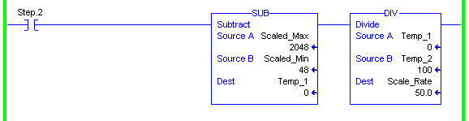

# Course Code – Course Title

## Test Bank

**Developer Directions – Delete before finalizing test**

All questions go into this test bank.

If a lesson has one learning objective, create three questions.

If a lesson has multiple learning objectives, create two questions per objective.

Correct answers should be identified in bold.

**Directions:**

You have approximately 30 minutes to complete this test. Test are comprised of multiple choice questions. Carefully read each question and circle the letter corresponding to the correct answer. You may use the course job aids when a question prompts you to search for the answer in them; however, you may not use your student manual to assist you in answering the test questions.

**Scoring:**

Correctly answered multiple choice questions are counted as two points. Your test score will be reported as the number of points received for correctly answered questions out of the total number of points available for the test. (Example: 26/30 points)

### Questions

#### Mnemonic 1

1. While interpreting code on a die machine, you come across a rung with an enabled output. However, you notice another output, programmed between two inputs, is false. Why hasn’t the state of this first output affected the second?
    a. Because both input instructions take priority over the output.
    a. Because the output is nonretentive and, therefore, does not affect the second.
    a. Because the first output instruction has no effect on the second.
    a. Because the rung scan takes precedence on the final output instruction.

2. You have been tasked with updating a production line and have been considering using interlaced inputs and outputs. Which factors would have most likely been attributed to your decision? (Two answers are correct.) 
    a. Interlacing makes troubleshooting easier.
    a. Interlacing might reduce the overall scan time. 
    a. Interlacing allows logic to be processed more thoroughly.
    a. Interlacing can reduce the number of rungs.

#### Mnemonic 2

3. You are interpreting math instructions in your application. When the rung below becomes true, what value would you expect to see in Scale_Rate?

    

    a. 0.0
    a. 50.0
    a. 20.0
    a. 209.6

4. You are interpreting math instructions in your coal transfer routine. Which of the following conditions describes when a Math instruction will execute within the code? 
    a. Only when the value in Source A or Source B changes.
    a. Continuously as long as the sum fits into the destination tag.
    a. Only once unless you add conditions that repeatedly toggle the rung between false and true.
    a. Whenever the rung is scanned.

---

**Notice**

Rockwell Automation makes no representations or warranties of any kind and disclaims any liability with respect to an individual’s particular qualifications or their ability to use or apply the information presented during the training in a particular application, process or other employment situation. Rockwell Automation makes no recommendation or comment on the individual’s ability to perform his/her job duties.

---
